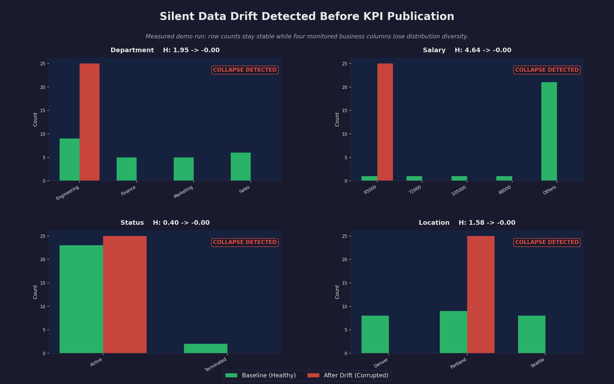
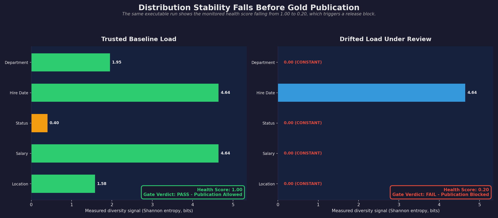
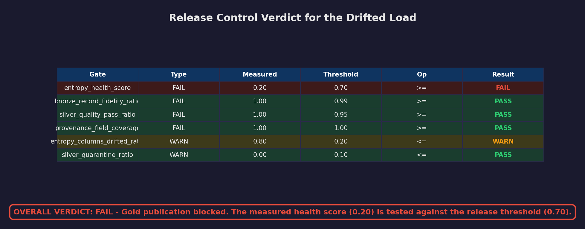

# Block Silent Data Failures Before They Reach Executive Dashboards

Built by Anthony Johnson | EthereaLogic LLC

`entropy_governed_medallion_demo` is a public demonstration of a Databricks release-control pattern that detects silent data drift before corrupted data reaches Gold tables, executive dashboards, or downstream AI workloads. The repository shows how to measure distribution stability, apply release gates, and emit audit-ready provenance from a repeatable local run.

## Executive Summary

| Leadership question | Answer |
| ------------------- | ------ |
| What business risk does this address? | Data can keep its schema and row counts while losing business meaning, allowing bad KPI refreshes to reach dashboards and decision workflows. |
| What does this demo prove? | The verified local run flags drift in 4 of 5 monitored business columns, drops the health score from `1.00` to `0.20`, and blocks the Gold refresh with a `FAIL` verdict. |
| Why does it matter for technology leaders? | It demonstrates a concrete control pattern for trusted KPI publication, governed medallion operations, and audit-ready incident evidence. |

## The Business Problem

Traditional pipeline controls are effective at catching missing files, broken schemas, and invalid records. They are less effective at catching silent distribution shifts, such as a source system defaulting a business field to one value or a category mix collapsing after an upstream change.

That kind of failure is operationally expensive because the pipeline may still look healthy: jobs complete, row counts reconcile, and dashboards refresh on time. The business only discovers the issue after leaders start questioning the numbers.

Technology leaders need a control at the Silver-to-Gold boundary that asks a harder question: does the current load still carry the same business signal as a trusted baseline?

## What This Demo Proves

The measured local demo run in this repository produces the following verified outcomes:

| Verified outcome | Evidence from the executable demo |
| ---------------- | --------------------------------- |
| Monitored business columns | `5` columns are evaluated in the local runner. |
| Drift detected | `4` columns are flagged as drifted. |
| Health score deterioration | The score drops from `1.00` on the baseline to `0.20` on the drifted load. |
| Publication decision | Overall verdict is `FAIL`; Gold refresh is blocked. |
| Record fidelity retained | Source rows: `25`; target rows: `25`; schema match: `True`. |
| Regression coverage | Test suite (`pytest tests/ -v`) completes successfully. |

## Verified Results

### Exhibit 1: Silent Drift Is Detected Before Publication

The measured demo compares a trusted baseline with a drifted load. Four monitored business columns collapse to a single value while the row count remains unchanged.

<p align="center">
  
</p>

### Exhibit 2: The Stability Score Falls Below the Release Threshold

The same executable run tracks five monitored business columns. After the simulated source failure, four of the five columns drop to zero measured diversity, which drives the health score down to `0.20`.

<p align="center">
  
</p>

### Exhibit 3: Gold Refresh Is Blocked

The release-control step evaluates six configured gates. The decisive failure is the distribution-stability gate: a measured health score of `0.20` falls below the `0.70` threshold, so the Gold refresh is blocked.

<p align="center">
  
</p>

## How the Control Works

1. A trusted Silver load establishes a baseline for monitored business columns.
2. Each new load is measured against that baseline to determine whether business signal has remained stable.
3. The per-column results are aggregated into a table health score.
4. Release gates decide whether Gold publication is allowed, warned, or blocked.
5. Provenance fields capture the run context, verdict, and drift evidence for auditability.

Under the hood, this demo uses Shannon entropy as the measurement technique behind the stability signal. That technical method is documented in [Technical approach](docs/technical-approach.md), while the README stays focused on the operating problem and the control outcome.

## Databricks Fit

This repository models a Databricks Bronze, Silver, and Gold control pattern:

- Bronze and Silver protect ingestion fidelity and prepare business-ready data.
- The Silver-to-Gold boundary adds a release-control step for distribution stability.
- Gold publication is allowed only when the measured health score stays above the configured threshold.
- Provenance records preserve the evidence needed for operational review and audit trails.

The checked-in code implements the control logic locally in Python and includes an illustrative Databricks notebook. It does not provision Azure Data Factory, ADLS Gen2, Unity Catalog, Databricks workspaces, or Asset Bundles.

## Quick Start

### 1. Create a local environment

Use Python 3.10 or newer. The commands below were verified with Python 3.12.

```bash
git clone https://github.com/Org-EthereaLogic/entropy_governed_medallion_demo.git
cd entropy_governed_medallion_demo
python3.12 -m venv .venv
. .venv/bin/activate
python -m pip install --upgrade pip
python -m pip install -e ".[dev]"
```

### 2. Run the regression suite

```bash
pytest tests/ -v --cov=entropy_governed_medallion
```

Expected result:

```text
40 passed
```

### 3. Run the local release-control demo

```bash
python -m entropy_governed_medallion.runners
```

Expected highlights from the verified run:

```text
Health Score : 0.2000
Columns      : 5 checked, 4 drifted
Overall Verdict: FAIL
Gold refresh BLOCKED — entropy drift exceeds threshold.
```

### 4. Regenerate the README exhibits

```bash
python -m pip install -e ".[docs]"
python docs/generate_visuals.py
```

### 5. Run the illustrative Databricks notebook

Upload `notebooks/04_entropy_deep_dive.py` to your Databricks workspace and run all cells. It uses `samples.nyctaxi.trips`, so no data upload is required.

## Technical Approach

For the architecture diagram, Shannon entropy formula, gate definitions, reproducibility notes, and repo map, see [Technical approach](docs/technical-approach.md).

## Engineering Signals

<p align="left">
  <a href="https://github.com/Org-EthereaLogic/entropy_governed_medallion_demo/actions/workflows/ci.yml"></a>
  <a href="https://app.codacy.com/gh/Org-EthereaLogic/entropy_governed_medallion_demo/dashboard"></a>
  <a href="https://codecov.io/gh/Org-EthereaLogic/entropy_governed_medallion_demo"></a>
</p>

## Support, Security, and Contribution

- Support requests: see [SUPPORT.md](SUPPORT.md).
- Security disclosures: see [SECURITY.md](SECURITY.md).
- Contribution guidelines: see [CONTRIBUTING.md](CONTRIBUTING.md).

## License

MIT License. See [LICENSE](LICENSE) for details.
