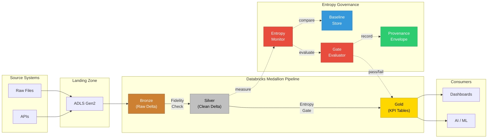
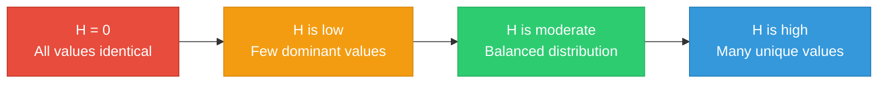
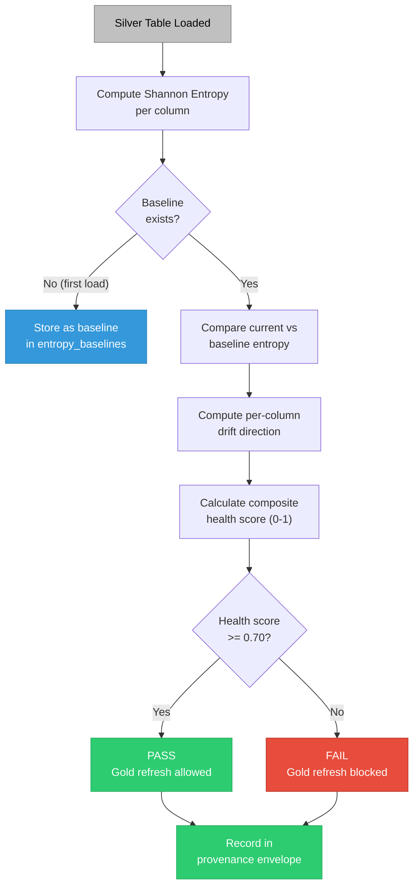

# Entropy-Governed Medallion Pipeline Demo

<p align="center">
  <a href="https://github.com/Org-EthereaLogic/entropy_governed_medallion_demo/actions/workflows/ci.yml"></a>
  <a href="https://app.codacy.com/gh/Org-EthereaLogic/entropy_governed_medallion_demo/dashboard"></a>
  <a href="https://app.codacy.com/gh/Org-EthereaLogic/entropy_governed_medallion_demo/dashboard"></a>
  <a href="https://codecov.io/gh/Org-EthereaLogic/entropy_governed_medallion_demo"></a>
  <a href="https://www.python.org/"></a>
  <a href="https://opensource.org/licenses/MIT"></a>
</p>

**Shannon Entropy as a Data Quality Signal for Databricks Bronze/Silver/Gold**

**Built by [Anthony Johnson](https://www.linkedin.com/in/anthonyjohnsonii/) | EthereaLogic LLC**

---

<details>
<summary><strong>Table of Contents</strong></summary>

- [What Makes This Different](#what-makes-this-different)
- [Architecture](#architecture)
- [The Entropy Quality Framework](#the-entropy-quality-framework)
- [See It in Action](#see-it-in-action)
- [Gate Evaluation Matrix](#gate-evaluation-matrix)
- [Technology Stack](#technology-stack)
- [Quick Start](#quick-start)
- [Project Structure](#project-structure)
- [Gate Definitions](#gate-definitions)
- [Contributing and Security](#contributing-and-security)

</details>

---

## What Makes This Different

Most medallion architecture demos stop at null checks and deduplication. This project introduces **Shannon Entropy as a governing data quality signal** across the entire pipeline — using information-theoretic measurement to detect distribution drift, schema instability, and quality degradation before they reach Gold.

**The core idea:** if you can measure the information content of your data at each layer, you can build quality gates that catch problems rule-based checks miss.

A column that passes every null check and type check can still be useless if its entropy has collapsed (e.g., 98% of values became the same constant after a source system change). Traditional validation wouldn't catch that. Entropy-based monitoring does.

---

## Architecture



**Data flow:** ADF moves raw extracts into ADLS Gen2. Databricks reads landed files into Bronze with source metadata. Silver enforces business rules, validates quality, and measures entropy baselines. Gold produces KPI-ready aggregates. At each transition, entropy scores are computed and compared against baselines to detect drift.

**Governance:** Unity Catalog provides centralized access control, lineage, and metadata across all layers.

---

## The Entropy Quality Framework

### Why Shannon Entropy?

Shannon Entropy (H) measures the **information diversity** of a data column's value distribution:

```text
H(X) = -Sigma p(xi) x log2(p(xi))
```



| Entropy Level | What It Means | Data Quality Signal |
| ------------- | ------------- | ------------------- |
| H = 0 | All values identical | Column is constant -- possible upstream failure |
| H is low | Few dominant values | Low cardinality -- check whether expected |
| H is moderate | Balanced distribution | Healthy variability |
| H is high | Many unique values | High cardinality -- expected for IDs, timestamps |

### What This Framework Detects (That Traditional Checks Miss)

| Scenario | What Happened | Traditional Checks | Entropy Signal |
| -------- | ------------- | ------------------ | -------------- |
| Silent source failure | Column diversity collapses -- source system defaulted all values | All pass | **COLLAPSE DETECTED** |
| Schema drift | New categories shift the distribution unexpectedly | All pass | **SPIKE DETECTED** |
| Cardinality collapse | Join keys that should be unique start clustering | All pass | **COLLAPSE DETECTED** |
| Freshness decay | Timestamp entropy drops because the same date repeats | All pass | **COLLAPSE DETECTED** |

### How It Works



---

## See It in Action

The following visualizations use the included sample datasets (`data/sample/employees_sample.csv` and `data/sample/employees_drifted.csv`) to demonstrate how entropy governance catches silent data corruption.

### Drift Detection: Before vs After

Both datasets pass null checks, type checks, and deduplication. Only entropy measurement reveals that four columns collapsed to a single constant value.

<p align="center">
  
</p>

### Entropy Health Dashboard

A per-column view of information content. The baseline (Week 1) shows healthy distribution across all columns. After a simulated source failure (Week 4), four columns drop to zero entropy -- the health score falls from 1.00 to 0.50, triggering a gate failure.

<p align="center">
  
</p>

### Gate Evaluation Matrix

The gate evaluator checks six quality thresholds before allowing a Gold table refresh. Even though five of six gates pass, the entropy health score failure blocks the entire pipeline -- preventing corrupted data from reaching executive dashboards.

<p align="center">
  
</p>

---

## Technology Stack

| Component | Technology |
| --------- | ---------- |
| Processing Engine | Azure Databricks (Spark) |
| Storage Format | Delta Lake |
| Languages | PySpark, SQL |
| Governance | Unity Catalog |
| Quality Framework | Shannon Entropy + rule-based validation |
| Gate Evaluation | Frozen KPI thresholds with typed contracts |
| Testing | pytest |
| Deployment | Databricks Asset Bundles |
| Automation | GitHub Actions CI + GitHub release artifacts |

## Automation

- **CI:** GitHub Actions runs `pytest` and `ruff` across Python 3.10, 3.11, and 3.12 on pushes and pull requests.
- **Commit validation:** Commitizen enforces Conventional Commits in pull requests and direct pushes.
- **Coverage:** Push builds generate `coverage.xml` and upload to both Codacy and Codecov.
- **Release delivery:** Version tags and manual dispatches build wheel and source distributions, upload them as workflow artifacts, and publish GitHub release assets on tag pushes.

---

## Quick Start

### 1. Clone and Install

Use Python 3.10 or newer. The commands below use `python3.12`; replace it with `python3.10` or `python3.11` if that is the supported interpreter installed on your machine.

```bash
git clone https://github.com/Org-EthereaLogic/entropy_governed_medallion_demo.git
cd entropy_governed_medallion_demo
python3.12 -m venv .venv
. .venv/bin/activate
python -m pip install --upgrade pip
python -m pip install -e ".[dev]"
```

### 2. Run Tests Locally

```bash
pytest tests/ -v
```

### 3. Run the Entropy Deep Dive in Databricks

Upload `notebooks/04_entropy_deep_dive.py` to your Databricks workspace and run all cells. Uses `samples.nyctaxi.trips` -- no uploads needed.

### 4. Explore Drift Detection

Compare `data/sample/employees_sample.csv` (healthy distribution) against `data/sample/employees_drifted.csv` (collapsed distributions). The entropy framework detects what null checks cannot.

### 5. Regenerate README Visuals

The README charts are reproducible from the sample CSVs in this repository.

```bash
. .venv/bin/activate
python -m pip install -e ".[docs]"
python docs/generate_visuals.py
```

---

## Project Structure

```text
entropy_governed_medallion_demo/
├── README.md
├── LICENSE
├── pyproject.toml
├── config/
│   └── kpi_thresholds.json              # Frozen gate definitions
├── src/entropy_governed_medallion/
│   ├── contracts/
│   │   └── models.py                    # Frozen typed dataclasses
│   ├── entropy/
│   │   ├── shannon.py                   # Core Shannon Entropy computation
│   │   ├── drift_detector.py            # Drift detection + table health scoring
│   │   └── baseline.py                  # Baseline capture and retrieval
│   ├── seams/
│   │   ├── materialization.py           # Bronze CREATE TABLE AS SELECT
│   │   ├── fidelity.py                  # Source vs target row count ratio
│   │   ├── entropy_capture.py           # THE KEY SEAM — entropy governance
│   │   └── quality_rules.py             # Rule-based validation engine
│   ├── gates/
│   │   └── evaluator.py                 # Gate evaluator with entropy FAIL gate
│   ├── provenance/
│   │   └── builder.py                   # Append-only provenance envelopes
│   ├── runners/                         # State-machine execution runner
│   ├── evidence/                        # Append-only evidence bundles
│   └── config/                          # Configuration loading
├── notebooks/
│   └── 04_entropy_deep_dive.py          # Interactive Databricks demonstration
├── data/sample/
│   ├── employees_sample.csv             # Baseline enterprise data
│   └── employees_drifted.csv            # Same schema, collapsed distributions
├── tests/
│   ├── test_drift_detection.py          # Drift scenario tests
│   └── test_gate_evaluator.py           # Gate evaluation tests
├── docs/
│   ├── images/                          # Generated visualizations
│   └── generate_visuals.py              # Visualization generation script
└── runs/                                # Append-only evidence bundles
```

---

## Gate Definitions

| Gate | Type | Threshold | What It Protects Against |
| ---- | ---- | --------- | ------------------------ |
| `entropy_health_score` | FAIL | >= 0.70 | Distribution drift reaching Gold |
| `bronze_record_fidelity_ratio` | FAIL | >= 0.99 | Row loss during ingestion |
| `silver_quality_pass_ratio` | FAIL | >= 0.95 | Data quality rule failures |
| `provenance_field_coverage` | FAIL | >= 1.0 | Missing audit trail fields |
| `entropy_columns_drifted_ratio` | WARN | <= 0.20 | Widespread distribution instability |
| `silver_quarantine_ratio` | WARN | <= 0.10 | Excessive quarantined records |

---

## What This Repo Does NOT Include

- Proprietary client data, formulas, or algorithms
- Production credentials or connection strings
- Enterprise networking or security configurations
- Proprietary quality scoring methods or formulas

---

## Contributing and Security

Contributions should preserve the repository's public-safe constraints, typed-contract architecture, and Shannon Entropy governance model. Follow the contribution workflow and conventional commit rules in [CONTRIBUTING.md](CONTRIBUTING.md).

If you discover a security issue, report it privately using the process in [SECURITY.md](SECURITY.md). Do not open public issues for sensitive disclosures.

---

## Author

**Anthony Johnson** -- US-Based Databricks & Enterprise AI Solutions Architect

- LinkedIn: [linkedin.com/in/anthonyjohnsonii](https://www.linkedin.com/in/anthonyjohnsonii/)
- Company: EthereaLogic LLC

---

## License

MIT License. See [LICENSE](LICENSE) for details.
