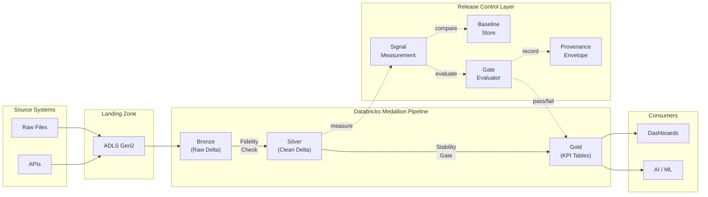

# Technical Approach

This page captures the technical detail behind the executive-facing README. It separates measured facts from reference architecture so operators can reproduce the local demo without confusing it with a fully provisioned Databricks deployment.

## What Is Implemented Here

| Surface | Included in this repository |
| ------- | --------------------------- |
| Executable control demo | Pure-Python local runner that loads sample CSVs, computes per-column Shannon entropy, detects drift, evaluates configured gates, and emits provenance. |
| Reusable library surfaces | PySpark modules for entropy measurement, drift detection, seam-based workflow components, and gate evaluation. |
| Evidence path | Sample data, generated visuals, regression tests, and a local CLI run that reproduces the public proof points. |
| Databricks example surface | An illustrative notebook against `samples.nyctaxi.trips`. |

The repository does **not** provision Azure Data Factory, ADLS Gen2, Unity Catalog, Databricks workspaces, or Databricks Asset Bundles.

## Reference Architecture

The diagram below shows the target Databricks control pattern that this repository models.



## Measurement Method

The stability signal in this demo is Shannon entropy, which measures how diverse a column's value distribution is:

```text
H(X) = −Σ p(xᵢ) × log₂(p(xᵢ))
```

Plain-language interpretation:

- A value of `0` means the column has collapsed to a constant.
- Low values mean only a few values dominate.
- Higher values mean the distribution remains diverse.

The local demo compares the current load against a trusted baseline and classifies each monitored column as stable, collapsed, or spiked. Those per-column outcomes roll up into a table health score.

## Configured Release Gates

The control thresholds come from `config/kpi_thresholds.json`.

| Gate | Type | Threshold | Purpose |
| ---- | ---- | --------- | ------- |
| `entropy_health_score` | FAIL | `>= 0.70` | Block Gold refresh when overall distribution stability degrades. |
| `bronze_record_fidelity_ratio` | FAIL | `>= 0.99` | Protect against row loss between source and target. |
| `silver_quality_pass_ratio` | FAIL | `>= 0.95` | Hold a place for rule-based Silver quality results. |
| `provenance_field_coverage` | FAIL | `>= 1.0` | Require a complete run context and audit envelope. |
| `entropy_columns_drifted_ratio` | WARN | `<= 0.20` | Highlight broad instability across monitored columns. |
| `silver_quarantine_ratio` | WARN | `<= 0.10` | Hold a place for quarantined-record volume. |

Important traceability note:

- In the current local demo, record fidelity and provenance are measured directly.
- `silver_quality_pass_ratio` and `silver_quarantine_ratio` are demo inputs passed into gate evaluation, not independently measured by the local runner.
- Public-facing documents should therefore avoid claiming that the executable sample run proves null checks, type checks, or deduplication results.

## Reproducible Evidence Path

Run these commands from the repository root:

```bash
python3.12 -m venv .venv
. .venv/bin/activate
python -m pip install --upgrade pip
python -m pip install -e ".[dev]"
PYTHONPATH=src pytest tests/ -q
python -m entropy_governed_medallion.runners
```

Optional exhibit regeneration:

```bash
python -m pip install -e ".[docs]"
python docs/generate_visuals.py
```

The verified local run should show:

- `5` monitored columns
- `4` drifted columns
- health score `0.2000`
- overall verdict `FAIL`
- Gold refresh blocked

## Repo Map

| Path | Role |
| ---- | ---- |
| `src/entropy_governed_medallion/runners/local_demo.py` | Reproducible local control demo and human-readable run output |
| `src/entropy_governed_medallion/entropy/` | Shannon entropy, baselines, and drift detection |
| `src/entropy_governed_medallion/gates/evaluator.py` | Gate evaluation and overall verdict logic |
| `src/entropy_governed_medallion/provenance/builder.py` | Audit-ready provenance envelope builder |
| `config/kpi_thresholds.json` | Frozen gate definitions and thresholds |
| `docs/generate_visuals.py` | Visuals generated from measured demo outputs |
| `tests/` | Unit and integration coverage for the local control path |

## Related Public Docs

- Executive overview: [README.md](../README.md)
- Contribution workflow: [CONTRIBUTING.md](../CONTRIBUTING.md)
- Support process: [SUPPORT.md](../SUPPORT.md)
- Security reporting: [SECURITY.md](../SECURITY.md)
